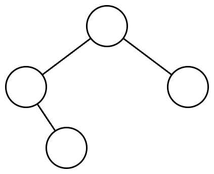
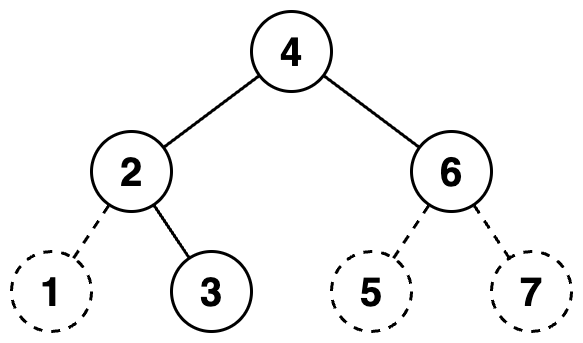

## 표현 가능한 이진트리
### 문제 설명

당신은 이진트리를 수로 표현하는 것을 좋아합니다.

이진트리를 수로 표현하는 방법은 다음과 같습니다.

1. 이진수를 저장할 빈 문자열을 생성합니다.
2. 주어진 이진트리에 더미 노드를 추가하여 포화 이진트리로 만듭니다. **루트 노드는 그대로 유지합니다**.
3. 만들어진 포화 이진트리의 노드들을 가장 왼쪽 노드부터 가장 오른쪽 노드까지, 왼쪽에 있는 순서대로 살펴봅니다. **노드의 높이는 살펴보는 순서에 영향을 끼치지 않습니다.**
4. 살펴본 노드가 더미 노드라면, 문자열 뒤에 0을 추가합니다. 살펴본 노드가 더미 노드가 아니라면, 문자열 뒤에 1을 추가합니다.
5. 문자열에 저장된 이진수를 십진수로 변환합니다.

이진트리에서 리프 노드가 아닌 노드는 자신의 왼쪽 자식이 루트인 서브트리의 노드들보다 오른쪽에 있으며, 자신의 오른쪽 자식이 루트인 서브트리의 노드들보다 왼쪽에 있다고 가정합니다.

다음은 이진트리를 수로 표현하는 예시입니다.

주어진 이진트리는 다음과 같습니다.

  
주어진 이진트리에 더미노드를 추가하여 포화 이진트리로 만들면 다음과 같습니다. 
더미 노드는 점선으로 표시하였고, 노드 안의 수는 살펴보는 순서를 의미합니다.

 
노드들을 왼쪽에 있는 순서대로 살펴보며 0과 1을 생성한 문자열에 추가하면 <kbd>"0111010"</kbd>이 됩니다. 
이 이진수를 십진수로 변환하면 58입니다.

당신은 수가 주어졌을때, 하나의 이진트리로 해당 수를 표현할 수 있는지 알고 싶습니다.

이진트리로 만들고 싶은 수를 담은 1차원 정수 배열 <kbd>numbers</kbd>가 주어집니다.  
<kbd>numbers</kbd>에 주어진 순서대로 하나의 이진트리로 해당 수를 표현할 수 있다면 1을, 표현할 수 없다면 0을 1차원 정수 배열에 담아 return 하도록 solution 함수를 완성해주세요.

### 제한사항
- 1 ≤ <kbd>numbers</kbd>의 길이 ≤ 10,000
  - 1 ≤ <kbd>numbers</kbd>의 원소 ≤ 1015

### 입출력 예
| numbers       | 	result    |
|---------------|------------|
| [7, 42, 5]    | 	[1, 1, 0] |
| [63, 111, 95] | 	[1, 1, 0] |
